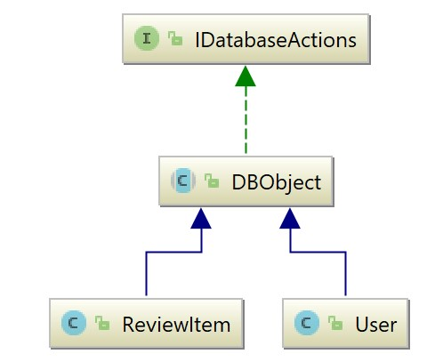

# Project for teaching professional java concepts

This project has aim of teaching professional concepts into official studies, as it has been done on the course 2017-2018 in IES Emili Darder for teaching security concepts in web development. 

It's build over web microframework with spark java (http://sparkjava.com/), over Maven dependencies (http://maven.apache.org/) in a multimodule approach with java 1.8, securized with spring Security 5.

Will be dockerized, and balanced through Kubernetes into an openshift backend as part of Computer Admininistration concepts. 

Introduces several concepts, like:

- Interfaces
- Abstract classes
- Conventional classes
- Inheritance
- Java Collections
- Basic Logging
- Maven
- Multimodule aproach
- SparkJava

## Frontend concepts: dummyweb module

- Configures spark to be rendered with freemarker properly, using the resources as it should be, exposing static files if needed
- Includes Bootstrap and Jquery via CDN
- Uses JSONTransformer to answer as Rest microservices, it also includes Jackson serialization
- Will include Spring Security
- Ambiguous response depending on http headers, same page can be answered as html or as api Rest

## Business layer concepts: dummycore module
- Integrates logging
- Basic interface concepts
Abstract class that implements part of an interface to generalize Business objects

- Maximizes code re-usage trough abstract classes for serialization
- Will include hsql
- May include Spring data if needed 

